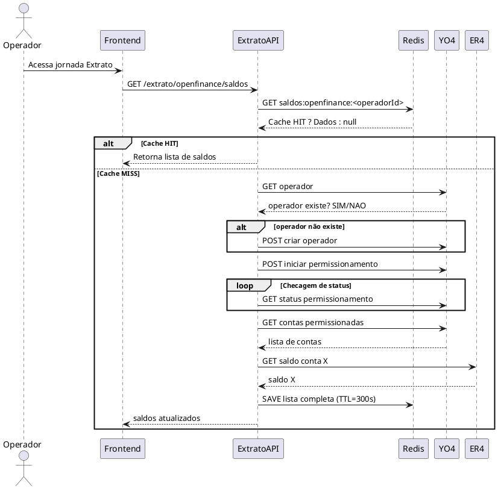

Perfeito — vou gerar **o documento técnico completo com diagramas C4**, incluindo:

* Contexto da solução
* Arquitetura
* Fluxo detalhado
* Diagramas C2 e C3 (formato PlantUML)
* Fluxo operacional (sequência PlantUML)
* Modelagem do cache Redis
* WBS
* Estimativa final
* Pontos de atenção
* Decisões técnicas

---

# 📘 **DOCUMENTO TÉCNICO COMPLETO – FEATURE: Consulta de Saldos Open Finance na Jornada de Extrato**

---

# 📌 **1. Objetivo da Feature**

Disponibilizar na jornada de **Extrato PJ** os **saldos de todas as contas Open Finance** do operador, sem agrupamentos, garantindo:

* Alto desempenho por meio de **cache em Redis**
* Criação do operador caso não exista
* Execução de permissionamento inicial e periódico (30 min)
* Consistência com YO4, IG3, ER4 e processos internos
* Experiência fluida sem múltiplas chamadas redundantes a ER4

---

# 🧭 **2. Contexto da Solução**

A jornada de Gestão Financeira PJ inclui:

* Agrupamentos
* Atualização em IG3/XF8
* Fluxo assíncrono via Kafka

Na jornada de Extrato:

* **Não há agrupamento**
* O operador deve sempre visualizar **todas as suas contas Open Finance**
* As contas precisam ser permissionadas via YO4
* O saldo de cada conta vem da ER4
* Para evitar latência e custo, é necessário **cache Redis per-operator**

---

# 🧱 **3. Arquitetura Geral da Solução (C4 – C2)**

Abaixo está o diagrama C2 no formato PlantUML.

---

## 📐 **3.1 Diagrama C2 (Contexto)**

```plantuml
@startuml
!include https://raw.githubusercontent.com/plantuml-stdlib/C4-PlantUML/master/C4_Context.puml

Person(operator, "Operador PJ", "Usuário que acessa a jornada de Extrato")

System(front, "Frontend Extrato PJ", "Angular")
System(api, "API Cadastro Multicontas - YO4", "Java/Spring Boot")
System(apiExtrato, "API Extrato", "Java/Spring Boot")
System(er4, "ER4 - Saldos", "Consulta de saldos de contas")
System(redis, "Redis (ElastiCache)", "Cache de saldos por operador")
System(ig3, "Produtos Financeiros - IG3", "Mantém produtos permitidos")
System(xf8, "Produtos Worker - XF8", "Replica produtos em Dynamo")
System(dbRds, "YO4 RDS", "Permissão de contas")
System(kafka, "Kafka IG3", "Eventos de permissionamento")

operator -> front : Acessa jornada de extrato\nSolicita saldos
front -> apiExtrato : GET /extrato/openfinance/saldos
apiExtrato -> redis : Consulta cache
apiExtrato -> api : Cria usuário se necessário\nExecuta permissionamento
apiExtrato -> er4 : Consulta saldos\n(se cache expirado)
apiExtrato -> redis : Atualiza cache
api -> kafka : Publica eventos
kafka -> ig3 : Cria produtos permitidos
ig3 -> xf8 : POST criar produtos

@enduml
```

---

# 🧱 **4. Arquitetura Interna (C4 – C3)**

## 📐 **4.1 Diagrama C3 – Componentes da API de Extrato**

```plantuml
@startuml
!include https://raw.githubusercontent.com/plantuml-stdlib/C4-PlantUML/master/C4_Component.puml

Container(apiExtrato, "API Extrato", "Java Spring Boot", "Entrega saldos Open Finance")

Component(controller, "ExtratoController", "API REST", "GET saldos")
Component(service, "SaldosService", "Business Logic", "Fluxo principal")
Component(cache, "SaldosCache", "Redis Client", "Leitura/Escrita")
Component(y4client, "YO4Client", "FeignClient", "Criação do operador e permissionamento")
Component(er4client, "ER4Client", "FeignClient", "Consulta saldos")
Component(model, "SaldoModel", "DTO", "Lista de saldos")

Rel(controller, service, "chama")
Rel(service, cache, "consulta / atualiza")
Rel(service, y4client, "consulta / cria operador")
Rel(service, er4client, "consulta saldos")
@enduml
```

---

# 🔄 **5. Fluxo Operacional – Diagrama de Sequência**



---

# 🔧 **6. Modelo de Cache – Redis**

### **Chave**

```
saldos:openfinance:<operadorId>
```

### **Valor (JSON)**

```json
{
  "operadorId": "123",
  "atualizadoEm": "2025-01-01T15:30:00Z",
  "saldos": [
    {
      "contaId": "001-12345-9",
      "saldo": 1500.32,
      "moeda": "BRL",
      "origem": "ER4"
    },
    {
      "contaId": "001-67890-1",
      "saldo": 210.50,
      "moeda": "BRL",
      "origem": "ER4"
    }
  ]
}
```

### **TTL sugerido:** 120–300 segundos

---

# 🧩 **7. WBS – Work Breakdown Structure**

## **Etapa 1 — Análise (10h)**

* Revisão da jornada, APIs e fluxos
* Compreensão de permissionamento YO4
* Definição de regras de cache e TTL

## **Etapa 2 — Implementação Backend (27h)**

* Configuração Redis
* Criação do cliente Redis
* Implementação do cache por operador
* Implementação do fluxo completo (YO4 + ER4 + Redis)
* Endpoint GET
* Fallbacks e resiliência

## **Etapa 3 — Testes (17h)**

* Unitários
* Integrados
* E2E com expiração

## **Etapa 4 — Infra e Documentação (9h)**

* Provisionamento Redis
* Métricas
* Documentação técnica

---

# 📊 **8. Estimativa Final**

**Total:** 63 horas
**Estimativa PERT:** ~64 horas
**Lead Time:** 4–5 dias úteis

---

# 🚨 **9. Pontos de Atenção**

### **1. Extrato vai solicitar criação do operador?**

**Sim.**
Extrato deve seguir o mesmo padrão do GF-PJ:

* Se operador não existir, criá-lo via YO4
* Iniciar permissionamento imediatamente

### **2. O que mostrar enquanto permissionamento ocorre?**

Recomendado retornar:

* Lista vazia de contas OF
* Flag `permissionamentoEmAndamento = true`
* Mensagem informativa “Estamos configurando o acesso às suas contas Open Finance”

### **3. Extrato deve solicitar repermissionamento a cada 30 minutos?**

**Sim, recomendável por consistência e segurança regulatória.**

---

# 🧠 **10. Decisões Técnicas**

1. **Redis como cache principal**, pela latência e TTL.
2. **Cache por operador**, não por conta, reduz round-trips e melhora resposta.
3. **TTL curto**, garantindo frescor sem onerar ER4.
4. **Extrato não exibe agrupamento**, apenas lista todas contas OF.
5. **Repermissionamento é assíncrono e não bloqueante.**

---

# ✔ Documento finalizado

Se quiser, posso gerar também:

* **Arquivo .puml** para cada diagrama
* **Documento em Markdown para Confluence**
* **Versão de entrega para o Jira**
* **Fluxo com ícones AWS** (EC2, Redis, Kafka, Dynamo, API Gateway)

É só pedir!
